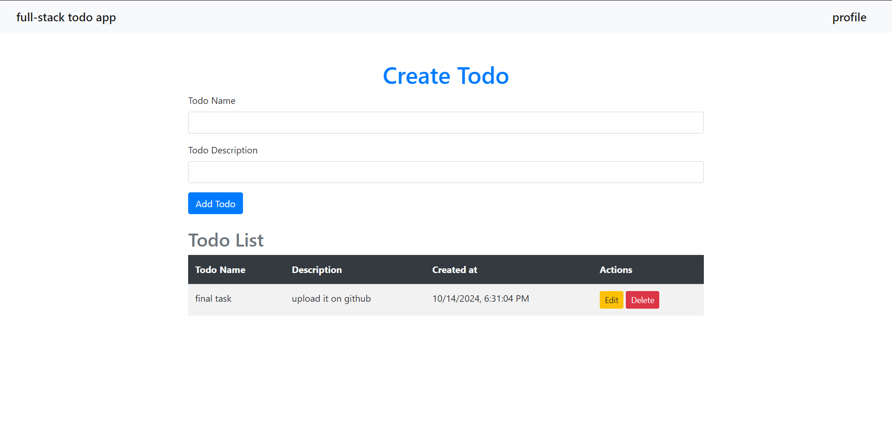

# Full-Stack Todo Application




## Introduction
The **Full-Stack Todo Application** is a web-based application designed to help users manage their tasks efficiently. Users can create, update, and delete todos, as well as upload their profile images. Built with modern technologies, this application showcases essential features like user authentication and file uploads, providing a robust platform for task management.

## Features
- User Registration and Login
- Create, Edit, and Delete Todos
- Upload and Display Profile Images
- Responsive Design
- User-friendly Interface
- Todo List with Timestamps

## Technologies Used
- **Frontend**: HTML, CSS, Bootstrap, EJS
- **Backend**: Node.js, Express.js
- **Database**: MongoDB (Mongoose)
- **File Upload**: Multer
- **Authentication**: Passport.js

## Getting Started
To get a local copy of the project up and running, follow these steps:

### Prerequisites
- Node.js installed on your machine
- MongoDB server running locally or remotely

### Installation
1. Clone the repository:
   ```bash
   git clone https://github.com/tahsinzidane/TaskFlow.git
   ```
2. Navigate to the project directory:
   ```bash
   cd TaskFlow
   ```
3. Install the required packages:
   ```bash
   npm install
   ```
4. Set up environment variables (create a `.env` file):
   ```plaintext
   MONGO_URI=your_mongodb_connection_string
   SESSION_SECRET=your_session_secret
   ```
5. Start the server:
   ```bash
   npm run dev
   ```
6. Open your browser and go to `http://localhost:3000`.

## API Endpoints
### User Endpoints
- **POST** `/register` - Register a new user
- **POST** `/login` - Log in an existing user
- **GET** `/profile` - Get user profile
- **POST** `/profile` - Update user profile (including image upload)

### Todo Endpoints
- **GET** `/` - Get all todos
- **POST** `/` - Create a new todo
- **GET** `/edit/:id` - Get a specific todo for editing
- **POST** `/edit/:id` - Update a specific todo
- **POST** `/delete/:id` - Delete a specific todo

## User Authentication
The application utilizes Passport.js for user authentication. Users can register, log in, and manage their sessions securely.

## File Uploads
The application allows users to upload their profile images using the Multer middleware. Uploaded images are stored in the `uploads` directory, 

## Screenshots


## Contributing
Contributions are welcome! Please follow these steps to contribute:
1. Fork the repository.
2. Create a new branch (`git checkout -b feature/YourFeature`).
3. Make your changes.
4. Commit your changes (`git commit -m 'Add some feature'`).
5. Push to the branch (`git push origin feature/YourFeature`).
6. Open a pull request.

## License
This project is licensed under the MIT License. See the [LICENSE](LICENSE) file for details.

